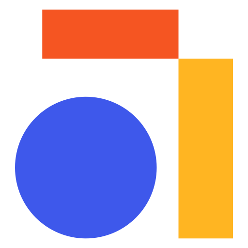

  

## Table of Contents
- [**Code Of Conduct**](#code-of-conduct)
- [**Disclaimer**](#disclaimer)
- [**List of Communities and Social Platforms**](#list-of-communities-and-social-platforms)

## Code of Conduct
This code of conduct outlines our expectations for all those who participate in our open source projects and communities (community programs), as well as the consequences for unacceptable behaviour. We invite all those who participate in helping us create safe and positive experiences for everyone. Communities mirror the societies in which they exist, and positive action is essential to counteract the many forms of inequality and power abuses. 

#### How to behave :

The following behaviours are expected and requested of all community members:

 - Participate authentically and actively. In doing so, you contribute to the health and longevity of this community.
 - Exercise consideration, respect and empathy in your speech and actions. Remember, we have all been through different stages of learning when adopting technologies.
 - Refrain from demeaning, discriminatory, or harassing behaviour and speech.
 - Disagreements on things are fine; argumentative behaviour or trolling is not.

#### How not to behave :

 - Do not perform threats of violence or use violent language directed against another person.
 - Do not make jokes of sexist, racist, homophobic, transphobic, ableist or otherwise discriminatory nature, or use language of this nature.
 - Do not post or display sexually explicit or violent material.
 - Do not post or threaten to post other people's personally identifying information ("doxing").
 - Do not make personal insults, particularly those related to gender, sexual orientation, race, religion, or disability.
 - Do not engage in sexual attention. This includes sexualised comments or jokes and sexual advances.
 - Do not advocate for, or encourage, any of the above behaviour.

Please take into account that online communities bring together people from many different cultures and backgrounds. It's important to understand that sometimes the combination of cultural differences and online interaction can lead to misunderstandings. That is why having empathy is very important.

#### How to report issues :

If someone is misbehaving or violating this Code of Conduct in any shape or form, and they are not receptive to your feedback, or you prefer not to confront them, please reach out to Anytype via community@anytype.io. 

#### Consequences of Unacceptable Behaviour :

Unacceptable behaviour from any community member shall not be tolerated. Anyone asked to stop inappropriate behaviour is expected to comply immediately. If a community member engages in unacceptable behaviour, Anytype or community organisers may take any action they deem appropriate, up to and including a temporary ban or permanent expulsion from the community without warning.

## Disclaimer
## List of Communities and Social platforms
### Official
These communities and social media accounts are moderated and maintained by the Anytype team.
- [**Discord**](https://discord.gg/kkvvUrSphq)
- [**Telegram**](https://t.me/anytype)
- [**Twitter**](https://twitter.com/anytypelabs)
- [**LinkedIn**](https://www.linkedin.com/company/anytype)
- [**Youtube**](https://www.youtube.com/channel/UCIqBAGm9K8MLS0btbXr9JkQ/featured)
- [**Reddit**](https://www.reddit.com/r/anytype)
### Community Created
The below mentioned communities, social media accounts and content platforms have been created and are being moderated and maintained by members of the Anytype community. Anytype does not have any say in the functioning and governing of these platforms.
- **Telegram**
  - [**Anytype China**](https://t.me/anytype_cn)
